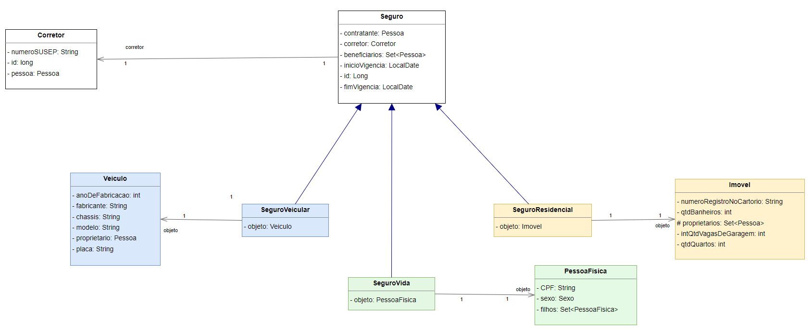

# Holding Benezinho Seguros 🤓👍🏾

Checkpoint II - Enterprise Application Development aplicada em 03/05/2023.

|                | **Enterprise Application Development** |
|------------------------------------------|----------------------------------------|
| **ALUNO:**                               | **TURMA:** 2TDSPI  - 2TDSPJ            |
| **PROFESSOR:** Benefrancis do Nascimento | 03/05/2023                             |
| **CHECK POINT II**                       | **VALE 10 PONTOS**                     |

# Sumário

[Estudo de caso ](#_Estudo_de_caso)

[O que deverá ser feito? ](#_O_que_devera_ser_feito)

[Diagrama de Classes ](#_Diagrama_de_Classes)

[Correção da Prova ](#_Correcao)

<a id="_Estudo_de_caso"></a>

# Estudo de caso

A Holding Benezinho  deseja entrar no concorrido mercado de seguros, para tal está desenvolvendo um revolucionário sistema para cadastramento de seguros.

Contratamos você e uma equipe de Arquitetos de Software para projetarem e construir um sistema capaz de registrar os seguros contratados no banco de dados.

Na sprint atual, você foi incumbido de fazer:

1. O Mapeamento Objeto Relacional das primeiras classes envolvidas neste projeto de software;

1. A criação automatizada das tabelas no banco de dados Oracle;


2. A persistência de todos os dados de um seguro, e;

1. A criação de dois métodos capazes de realizar consultas aos dados persistidos previamente:

1. Consulta todos os seguros findAll;
2. Consulta seguro pela chave primária findById.

Veja o Diagrama de Classes abaixo (as classes já foram criadas):


<a id="_O_que_devera_ser_feito"></a>

# O que deverá ser feito?

Na sprint atual, você foi incumbido de fazer:

1. O Mapeamento Objeto Relacional das primeiras classes envolvidas neste projeto de software;
2. A criação automatizada das tabelas no banco de dados Oracle;
3. A persistência dos dados dos seguros;
4. A criação de dois métodos capazes de realizar consultas aos dados persistidos previamente. 
      1. Consulta todos os seguros findAll 
      2. Consulta seguro pela chave primária findById


**Importe o projeto do github :**


https://github.com/Benefrancis/seguro-holding-benezinho.git


Caso o github esteja indisponível, você deverá pegar o projeto no diretório compartilhado.

**Você deverá:**

1. **(0,5 Ponto)** acessar o arquivo persistence.xml e alterar as configurações da **persistence-unit** para que seja possível conectar-se ao banco de dados Oracle da FIAP com o seu usuário e senha (manter o seu usuário e senha ativo é sua responsabilidade). Não utilize o usuário e senha de outro aluno. Caso tenha problema para autenticar, comunique o professor.


2. **(1,5 Ponto)** adicionar corretamente as anotações JPA na classe **Imovel**. 
   
   Lembre-se que:
   1. Deverá adicionar uma _constraint_ para que não seja possível ter mais de um Imóvel com o mesmo **número de registro no cartório** na tabela do banco de dados;
   2. Existe relacionamento Muitos para Muitos entre **Imovel** e **Pessoa** no atributo proprietários.


3. **(1,5 Ponto)** adicionar corretamente as anotações JPA na classe **Veiculo**. 
   
   Lembre-se que:
   1. Deverá adicionar duas _constraint_ para que não seja possível ter mais de um veículo com o mesmo **chassis ou com a mesma placa** na tabela do banco de dados;
   2. Existe relacionamento Muitos para Um entre **Veículo** e **Pessoa** no atributo proprietário.
   

4. **(1,5 Ponto)** adicionar corretamente as anotações JPA na classe **Corretor**. 
 
   Lembre-que:
   1. Deverá adicionar uma _constraint_ para que não seja possível ter mais de um **Corretor** de seguro com o mesmo número de cadastro na SUSEP (SUSEP - Superintendência de Seguros Privados) na tabela do banco de dados;
   2. Existe relacionamento Muitos para Um entre **Corretor** e **Pessoa** no atributo pessoa.
   

5. **(4 Pontos)** adicionar corretamente as anotações JPA na classe **Seguro**.

   Lembre-se que:
   
   1. **(1 ponto)** Existe relação **Muitos para Um** entre:
      1. Seguro e Contratante;
      2. Seguro e Corretor;

   2. **(2 pontos)** A classe Seguro possui três classes herdeiras:
      1. Seguro Residencial;
      2. Seguro Veicular;
      3. Seguro de Vida.

   3. **(1 ponto)** Existe relação **Muitos para Muitos** entre Seguro e beneficiários;

6. **(0,5 Ponto)** criar um método capaz de consultar um **Seguro** pelo seu identificador na correspondente tabela no banco de dados;

7. **(0,5 Ponto)** criar um método capaz de consultar todos os **Seguros** na correspondente tabela no banco de dados;


<a id="_Diagrama_de_Classes"></a>

# Diagrama de Classes




<a id="_Correcao"></a>

# Correção da Prova

A correção da prova será disponibilizada no github do professor (branch correcao):

Para acessar digite no prompt:

```shell
git clone https://github.com/Benefrancis/seguro-holding-benezinho.git && cd seguro-holding-benezinho && git checkout correcao
```

A prova é individual, em caso de fraude de qualquer tipo todos os envolvidos receberão nota ZERO.

Boa prova.